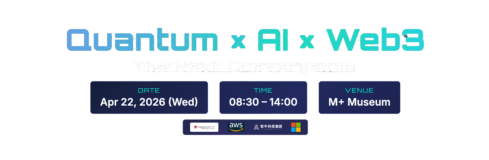

<div align="center">



# ⚛️ Quantum Web3 Interactive Registration

### Real-time Telegram Photo Wall · Quantum-Authenticated · AWS Serverless

<p>
  <a href="https://nextjs.org/"></a>
  <a href="https://aws.amazon.com/braket/"></a>
  <a href="https://aws.amazon.com/cdk/"></a>
  <a href="https://www.typescriptlang.org/"></a>
  <a href="LICENSE"></a>
</p>

<p>
  <a href="#-overview">Overview</a> ·
  <a href="#-architecture">Architecture</a> ·
  <a href="#-repository-structure">Repo Structure</a> ·
  <a href="#-quantum-signatures">Quantum Signatures</a> ·
  <a href="#-quick-start">Quick Start</a> ·
  <a href="#-documentation">Documentation</a>
</p>

---

> **A production-grade event photo wall** that ingests Telegram group messages in real time, authenticates each participant with a unique quantum signature generated by **AWS Braket SV1**, and renders everything as draggable sticky notes on a sci-fi web canvas.

</div>

---

<details>
<summary><strong>🔬 What makes this "quantum"? — A plain-language primer</strong></summary>
<br>

Classical computers store information as **bits** — each one is either 0 or 1, like a light switch that is either off or on. A quantum computer uses **qubits**, which exploit two phenomena from quantum mechanics:

- **Superposition** — a qubit can be 0 and 1 *simultaneously* until it is measured, much like a coin spinning in the air is neither heads nor tails until it lands.
- **Entanglement** — two qubits can be linked so that measuring one instantly determines the state of the other, regardless of the distance between them. Einstein famously called this "spooky action at a distance."

This project uses a **quantum simulator** (AWS Braket SV1) to run small quantum circuits and harvest the inherent randomness of quantum measurement. The result is a number that is fundamentally unpredictable — not just hard to predict, but *physically impossible* to predict before the measurement occurs. That number seeds a cryptographic signature unique to each event participant.

**Why does this matter for identity?** Traditional random-number generators on classical computers are *pseudo*-random — they follow a deterministic algorithm that could, in principle, be reverse-engineered. Quantum randomness has no such algorithm underneath it. Using it as the root of a signature means the identity token carries a provenance that classical systems cannot replicate.

</details>

---

## 🌐 Overview

> **In plain terms:** Think of this as a live digital bulletin board for an event. Attendees post photos and messages in a Telegram group chat; those posts instantly appear as colourful sticky notes on a shared web screen — each one stamped with a unique identity token that was generated by a quantum computer. No two tokens are alike, and the randomness behind each one is rooted in the laws of physics rather than software.

When a participant sends a photo or message **@mentioning the bot** in a configured Telegram group, the system:

1. **Validates** the webhook request and sanitizes all input
2. **Uploads** any attached photo to a private, encrypted S3 bucket
3. **Generates** a unique quantum signature via AWS Braket SV1 (4-qubit RNG + 2-qubit Bell state)
4. **Persists** the message and signature to DynamoDB
5. **Renders** the message as a colorful, draggable sticky note on the live photo wall

Each user's signature is computed **once** on their first message and reused thereafter — keeping Braket costs minimal while preserving the quantum-authenticated identity across all their contributions.

### ✨ Key Features

| Feature | Detail |
|---|---|
| 🔴 **Real-time wall** | 5-second polling; new cards animate in automatically |
| ⚛️ **Quantum signatures** | AWS Braket SV1 — 4-qubit RNG + Bell state per unique sender |
| 🃏 **Draggable cards** | Positions persist as percentages in DynamoDB (responsive) |
| 👥 **Multi-group** | Each Telegram group gets its own isolated wall at `/wall/{groupId}` |
| 🏆 **Leaderboard** | Top senders ranked by message count |
| 🔒 **Admin dashboard** | Password-protected soft-delete, clear-all, group stats |
| 🌍 **Custom domain** | Route53 + ACM + CloudFront with full TLS |
| 🛡️ **Security-first** | Zero secrets in code; Secrets Manager, HSTS, CSP, XSS protection |

---

## 🏗️ Architecture

> **In plain terms:** The system has three layers — a *front door* (CloudFront CDN) that the public sees, a *processing engine* (a containerised web server running on AWS) that handles logic, and a *data layer* (database + file storage + quantum computer) that stores and authenticates everything. Telegram acts as the input channel: it pushes new messages to the engine the moment they are sent.

```
┌─────────────────────────────────────────────────────────────────────┐
│                        USER INTERFACE                               │
│  Browser → CloudFront (CDN · TLS · Security Headers)               │
│               └─→ Next.js (PhotoWall · MessageCard · Admin)         │
└──────────────────────────────┬──────────────────────────────────────┘
                               │
                               ▼
┌─────────────────────────────────────────────────────────────────────┐
│                      BACKEND / API LAYER                            │
│  ALB (secret header validation) → ECS Fargate (Next.js · Docker)   │
│                                                                     │
│  POST /api/webhook/[groupId]   ← Telegram pushes messages here      │
│  GET  /api/messages/[groupId]  → Paginated messages + signed URLs   │
│  GET  /api/groups              → Available group list               │
│  POST /api/admin               → Admin login                        │
│  GET  /api/health              → ALB health check                   │
└──────────┬──────────────────────────────────────────────────────────┘
           │
     ┌─────┴──────┬──────────────┐
     ▼            ▼              ▼
┌─────────┐  ┌─────────┐  ┌──────────────────────────────────────────┐
│DynamoDB │  │   S3    │  │         AWS Braket SV1                   │
│messages │  │ photos  │  │  4-qubit RNG circuit  (100 shots)        │
│positions│  │ results │  │  2-qubit Bell state   (200 shots)        │
│encrypted│  │private  │  │  → ToyLWE signature + HSL visual color  │
│  PITR   │  │versioned│  │  → Graceful local-crypto fallback        │
└─────────┘  └─────────┘  └──────────────────────────────────────────┘
```

<details>
<summary><strong>🔬 Why these architectural choices? — Concepts explained</strong></summary>
<br>

**CDN (Content Delivery Network — CloudFront)**
A CDN is a geographically distributed network of servers that caches and delivers content from the location closest to each user. Think of it as having a local post office in every city rather than one central warehouse: your letter (web page) arrives faster because it travels a shorter distance. CloudFront also acts as a security shield — it strips malicious headers and enforces HTTPS before any request reaches the application.

**Containers & ECS Fargate**
A container packages an application and all its dependencies into a single, portable unit — like a shipping container that can be loaded onto any vessel regardless of what is inside. ECS Fargate runs these containers on AWS without requiring you to manage the underlying servers. The system automatically adds more containers when traffic spikes (e.g., during a live event) and removes them when traffic drops, so you only pay for what you use.

**DynamoDB (NoSQL database)**
Traditional relational databases store data in rigid tables with fixed columns, like a spreadsheet. DynamoDB is a *NoSQL* database that stores flexible documents, making it well-suited for message data where each record may have different fields (some messages have photos, some do not). It scales automatically and charges per read/write operation rather than per server — ideal for bursty event traffic.

**Webhook vs. polling**
A *webhook* is a "push" model: Telegram calls your server the instant a new message arrives, like a doorbell. The alternative — *polling* — would mean your server repeatedly asks Telegram "any new messages?" every few seconds, like repeatedly checking your mailbox. The backend uses a webhook for receiving messages (efficient, near-instant) while the browser uses polling to refresh the wall display (simpler, sufficient for a 5-second update cadence).

</details>

### AWS Infrastructure at a Glance

| Service | Role |
|---|---|
| **ECS Fargate** | Next.js container (1–4 instances, auto-scales at 70% CPU) |
| **Application Load Balancer** | Secret-header validation; blocks direct access |
| **CloudFront** | CDN, TLS termination, security headers, custom domain |
| **Route53 + ACM** | DNS alias + managed TLS certificate |
| **DynamoDB** | Message store — pay-per-request, encrypted, PITR enabled |
| **S3 (photos)** | Private, encrypted, versioned; pre-signed URL access |
| **S3 (Braket)** | `amazon-braket-*` results bucket |
| **Secrets Manager** | Bot tokens, webhook secret, admin password |
| **AWS Braket SV1** | Quantum random number + Bell state measurement |
| **VPC + NAT** | Private subnets for ECS; NAT for outbound Telegram API calls |

---

## 📁 Repository Structure

```
quantum-web3-interactive-registration-main/
│
├── 📦 bin/
│   └── app.ts                          # CDK application entry point
│
├── 🏗️  lib/
│   └── telegram-photo-wall-stack.ts    # Full AWS CDK infrastructure stack
│                                       # (VPC · ECS · ALB · CloudFront · DynamoDB
│                                       #  S3 · Secrets Manager · Route53 · ACM)
│
├── 🌐 photo-wall/                      # Next.js 15 application (frontend + API)
│   ├── src/
│   │   ├── app/
│   │   │   ├── page.tsx                # Root redirect to first group wall
│   │   │   ├── wall/[groupId]/         # 📸 Live photo wall page
│   │   │   ├── admin/                  # 🔐 Admin dashboard (password-protected)
│   │   │   └── api/
│   │   │       ├── webhook/[groupId]/  # ← Telegram webhook receiver
│   │   │       ├── messages/[groupId]/ # ← Message CRUD + position persistence
│   │   │       ├── groups/             # ← Group list endpoint
│   │   │       ├── admin/              # ← Admin login + actions
│   │   │       └── health/             # ← ALB health check
│   │   ├── components/
│   │   │   ├── PhotoWall.tsx           # Main wall: polling, grid layout, drag
│   │   │   ├── MessageCard.tsx         # Sticky note + quantum badge
│   │   │   ├── GroupNav.tsx            # Group switcher navigation
│   │   │   └── Lightbox.tsx            # Full-screen image preview
│   │   └── lib/
│   │       ├── aws.ts                  # AWS SDK client singletons
│   │       ├── config.ts               # Group configuration parser
│   │       ├── sanitize.ts             # Input sanitization (XSS prevention)
│   │       └── quantum-signature.ts    # ⚛️ Braket SV1 quantum signature engine
│   ├── public/
│   │   ├── logo.png                    # Event logo (top-center overlay)
│   │   └── banner.jpg                  # Background banner
│   ├── Dockerfile                      # Multi-stage Node 20 Alpine build
│   └── package.json
│
├── 📜 scripts/
│   ├── setup-local-env.sh              # Pull CDK outputs → .env.local
│   ├── set-webhook-local.sh            # Point Telegram webhook → ngrok
│   └── set-webhook-prod.sh             # Restore Telegram webhook → production
│
├── 📚 docs/
│   ├── en/
│   │   ├── architecture.md             # System design, API specs, data flow
│   │   ├── requirements.md             # Functional & non-functional requirements
│   │   ├── local-development.md        # Local dev setup guide
│   │   ├── quantum-key-generation.md   # Quantum circuit & signature deep-dive
│   │   ├── telegram-integration-guide.md # Telegram bot setup walkthrough
│   │   ├── add-new-group.md            # How to add a new group wall
│   │   └── user-experience/            # UX screenshots
│   └── zh/                             # 📖 Full Chinese documentation mirror
│
├── 🚀 deploy.sh                        # One-command full deployment script
├── cdk.json                            # CDK context: groups + domain config
├── package.json                        # CDK dependencies
├── CONTRIBUTING.md
└── LICENSE                             # MIT
```

---

## ⚛️ Quantum Signatures

> **In plain terms:** Every person who posts on the wall receives a unique "quantum fingerprint" — a short code that was generated using the genuine randomness of quantum physics. It is displayed as a badge on their sticky note (`Q#452 | 7B284BB3D413`) and serves as a tamper-evident identity token for the duration of the event.

### How it works — step by step

```
Step 1 — 4-qubit Random Number Circuit
  H gates → CNOT chain → Ry(seed-based rotations) → Measure (100 shots)
  → quantumNumber ∈ [0, 1000]

Step 2 — 2-qubit Bell State Circuit
  H q[0] → CNOT q[0],q[1] → Measure (200 shots)
  → bellState = [P(|00⟩), P(|01⟩), P(|10⟩), P(|11⟩)]

Step 3 — ToyLWE Signature Derivation
  SHAKE-256(seed + quantumNumber + randomBytes) → publicKeyHash (12 hex chars)
  SHA-256 chain → signature (24 chars, base64)

Step 4 — Visual Color
  HSL derived from quantumNumber + bellState probabilities
  → unique per-user card border color
```

<details>
<summary><strong>🔬 Unpacking the science — intuition for each step</strong></summary>
<br>

**Step 1 — Quantum Random Number Generation (4-qubit circuit)**

A classical computer generates "random" numbers using a mathematical formula seeded by something like the current time. Given the same seed, it always produces the same sequence — it is *deterministic*. A quantum circuit is different.

The circuit places four qubits into **superposition** using Hadamard (H) gates — each qubit is simultaneously 0 and 1. CNOT gates then **entangle** the qubits, linking their fates together. Finally, the circuit is measured 100 times ("100 shots"). Each measurement collapses the superposition and produces a random bitstring (e.g., `0110`, `1001`, `1101`…). The most frequently observed bitstring is converted to an integer — the *quantum number*.

The key insight: the outcome of each measurement is not determined by any prior state of the universe. It is genuinely random, in the same sense that radioactive decay is random. No algorithm, no matter how powerful, could have predicted it.

**Step 2 — Bell State Measurement (2-qubit circuit)**

A Bell state is one of the simplest and most famous examples of quantum entanglement. The circuit creates the state |Φ+⟩ = (|00⟩ + |11⟩) / √2 — meaning the two qubits are perfectly correlated: when measured, they are *always* both 0 or both 1, never mixed. Measuring this 200 times produces a probability distribution across the four possible outcomes (|00⟩, |01⟩, |10⟩, |11⟩).

In an ideal simulator, you expect roughly 50% |00⟩ and 50% |11⟩. The small deviations from perfect 50/50 — caused by the seed-based rotations applied in Step 1 — are unique to each user's input and contribute additional entropy to the signature.

**Step 3 — ToyLWE Signature**

LWE stands for **Learning With Errors**, a mathematical problem that is believed to be hard even for quantum computers to solve — making it a candidate for *post-quantum cryptography*. The "Toy" prefix signals that this implementation is a simplified, illustrative version rather than a production-hardened cryptographic primitive.

The quantum number from Step 1 is mixed with the user's name and random bytes using SHAKE-256 (a cryptographic hash function) to produce a *public key hash* — a short, shareable fingerprint. A second hash chain produces the *signature* itself. Together they form a pair: the signature can be verified against the public key hash, but the public key hash cannot be reversed to recover the original inputs.

**Step 4 — Visual Color from Quantum Data**

The quantum number and Bell state probabilities are mapped to an HSL (Hue, Saturation, Lightness) colour value. HSL is a perceptually intuitive colour model: hue is the "colour wheel" position (0°–360°), saturation is how vivid the colour is, and lightness is how bright it is. Because the quantum number spans 0–1000 and the Bell probabilities add continuous variation, each user's colour is visually distinct — you can literally *see* the quantum identity on the wall.

</details>

**Displayed on each card as:** `Q#452 | 7B284BB3D413`

> Signature is computed **once per sender per group** and reused on all subsequent messages. If Braket is unavailable, the system falls back to a local crypto-seeded equivalent — the wall never blocks.

### Quantum Circuit Diagrams

**Circuit A — 4-qubit Random Number Generator**
```
q[0]: ─ H ─ ● ─────────── Ry(θ₀) ─ M
q[1]: ─ H ─ ⊕ ─ ● ─────── Ry(θ₁) ─ M
q[2]: ─ H ─────── ⊕ ─ ● ─ Ry(θ₂) ─ M
q[3]: ─ H ─────────── ⊕ ─ Ry(θ₃) ─ M

θᵢ = π × (charCode(username[i]) mod 128) / 128
Shots: 100  →  most frequent bitstring  →  quantumNumber
```

**Circuit B — 2-qubit Bell State |Φ+⟩**
```
q[0]: ─ H ─ ● ─ M
q[1]: ───── ⊕ ─ M

Shots: 200  →  [P(00), P(01), P(10), P(11)]  →  bellState
```

---

## 🚀 Quick Start

### Prerequisites

<table>
<tr><td>Node.js 20+</td><td><code>node --version</code></td></tr>
<tr><td>AWS CDK CLI</td><td><code>npm install -g aws-cdk</code></td></tr>
<tr><td>AWS account (CDK bootstrapped)</td><td><code>cdk bootstrap</code></td></tr>
<tr><td>Docker</td><td>Required for ECS container build</td></tr>
<tr><td>Telegram Bot token</td><td>Create via <a href="https://t.me/BotFather">@BotFather</a></td></tr>
</table>

---

### Step 1 — Store Bot Token in Secrets Manager

```bash
aws secretsmanager create-secret \
  --name "telegram/bot-token/demo-group" \
  --secret-string "YOUR_BOT_TOKEN_HERE" \
  --region us-west-2
```

### Step 2 — Configure Groups in `cdk.json`

```json
{
  "context": {
    "telegramGroups": [
      {
        "groupId": "my-team",
        "chatId": "-1001234567890",
        "name": "My Team Photo Wall",
        "secretName": "telegram/bot-token/my-team",
        "botUsername": "my_photo_wall_bot"
      }
    ]
  }
}
```

| Field | Description | Example |
|---|---|---|
| `groupId` | URL slug for the wall | `my-team` |
| `chatId` | Telegram group Chat ID | `-1001234567890` |
| `name` | Display name on the wall | `My Team Photo Wall` |
| `secretName` | Secrets Manager secret name | `telegram/bot-token/my-team` |
| `botUsername` | Bot's @username (only @mentions shown) | `my_photo_wall_bot` |

### Step 3 — (Optional) Configure Custom Domain

```json
{
  "context": {
    "domain": {
      "name": "wall.example.com",
      "hostedZoneId": "ZXXXXXXXXXXXXX",
      "hostedZoneName": "example.com",
      "certificateArn": "arn:aws:acm:us-east-1:123456789:certificate/xxx"
    }
  }
}
```

> ACM certificate **must** be requested in `us-east-1` for CloudFront. CDK automatically creates the Route53 A record alias.

### Step 4 — Deploy

```bash
./deploy.sh
```

Or manually:

```bash
npm install
cd photo-wall && npm install && npm run build && cd ..
npx cdk deploy
```

### Step 5 — Register the Telegram Webhook

```bash
WEBHOOK_SECRET=$(aws secretsmanager get-secret-value \
  --secret-id telegram/webhook-secret \
  --query SecretString --output text \
  --region us-west-2)

curl -X POST "https://api.telegram.org/bot<BOT_TOKEN>/setWebhook" \
  -H "Content-Type: application/json" \
  -d '{
    "url": "https://<YOUR_CLOUDFRONT_DOMAIN>/api/webhook/demo-group",
    "secret_token": "'"$WEBHOOK_SECRET"'",
    "allowed_updates": ["message"]
  }'
```

### Step 6 — Add Bot to Telegram Group

1. Add your bot to the Telegram group
2. In **BotFather → Bot Settings → Group Privacy → Turn off** (so the bot can read all messages)
3. Members send messages with `@your_bot_username` — they appear on the wall instantly

---

## 🔐 Admin Dashboard

Access at `https://<YOUR_DOMAIN>/admin`

```bash
# Retrieve the auto-generated admin password
aws secretsmanager get-secret-value \
  --secret-id "telegram/admin-password" \
  --query SecretString --output text \
  --region us-west-2
```

| Capability | Description |
|---|---|
| **Message list** | View all messages with sender, text, type, quantum status |
| **Hide message** | Soft-delete individual messages (data preserved in DynamoDB) |
| **Clear all** | Soft-delete all messages for a group |
| **Group selector** | Switch between groups when multiple are configured |

---

## 🛡️ Security Model

> **In plain terms:** The system is designed so that even if an attacker intercepts network traffic, gains access to the server's environment variables, or finds the public URL of the load balancer, they still cannot read messages, forge requests, or access photos. Every sensitive credential lives in a dedicated secrets vault, and every layer of the stack validates that requests come from a legitimate source before acting on them.

<details>
<summary><strong>🔬 Security concepts explained for non-specialists</strong></summary>
<br>

**Why "secrets in Secrets Manager" matters**
Developers often accidentally commit API keys or passwords directly into source code, where they become visible to anyone with repository access — and to automated scanners that continuously harvest leaked credentials from public repos. AWS Secrets Manager is a dedicated vault: the application retrieves credentials at runtime using an IAM role, so the actual values never appear in code, configuration files, or container images.

**What is TLS / HTTPS?**
TLS (Transport Layer Security) is the protocol that encrypts data in transit between your browser and a server. The padlock icon in your browser's address bar indicates TLS is active. Without it, anyone on the same network (e.g., a coffee-shop Wi-Fi) could read the data flowing between you and the site. HSTS (HTTP Strict Transport Security) is an additional instruction that tells browsers to *always* use HTTPS for this domain, even if a user types `http://` — preventing downgrade attacks.

**What is XSS (Cross-Site Scripting)?**
If a web application displays user-submitted text without sanitizing it, an attacker can submit text that contains JavaScript code. When other users view the page, their browsers execute that code — potentially stealing session tokens or redirecting them to malicious sites. This system encodes all user input as HTML entities (e.g., `<` becomes `&lt;`) before storing or displaying it, so injected code is rendered as harmless text.

**What is least-privilege IAM?**
IAM (Identity and Access Management) controls what AWS resources each component is allowed to access. "Least privilege" means each component is granted only the minimum permissions it needs — the web server can read from DynamoDB and S3, but cannot, for example, delete IAM roles or access other AWS accounts. This limits the blast radius if any component is compromised.

</details>

| Layer | Mechanism |
|---|---|
| **Secrets** | All tokens and passwords in AWS Secrets Manager — never in code or env files |
| **Webhook auth** | `X-Telegram-Bot-Api-Secret-Token` header validated on every request |
| **ALB protection** | CloudFront secret header (`X-CloudFront-Secret`) blocks direct ALB access |
| **Admin auth** | Bearer token (password from Secrets Manager) on all write endpoints |
| **S3 access** | Fully private; photos served via pre-signed URLs (1-hour expiry) |
| **Encryption** | DynamoDB + S3 encrypted at rest (AWS-managed keys) |
| **Transport** | HTTPS everywhere; HSTS enforced via CloudFront |
| **Input safety** | HTML entity encoding, 4096-char max, XSS prevention |
| **Security headers** | HSTS · X-Frame-Options · CSP · X-XSS-Protection via CloudFront |
| **IAM** | Least-privilege ECS task role; no wildcard permissions |
| **Container** | Runs as non-root user; multi-stage Docker build (minimal attack surface) |

---

## 💻 Local Development

```bash
# 1. Pull resource IDs from the deployed CDK stack into .env.local
./scripts/setup-local-env.sh

# 2. Start the dev server
cd photo-wall
npm install
npm run dev
# → http://localhost:3000/wall/demo-group
```

For webhook debugging, expose your local port with [ngrok](https://ngrok.com/):

```bash
ngrok http 3000
./scripts/set-webhook-local.sh https://abcd1234.ngrok-free.app

# When done, restore production webhook:
./scripts/set-webhook-prod.sh
```

> See the full guide: [docs/en/local-development.md](docs/en/local-development.md)

---

## 📚 Documentation

<table>
<tr>
  <th>Document</th>
  <th>English</th>
  <th>中文</th>
</tr>
<tr>
  <td>🏗️ Architecture & Data Flow</td>
  <td><a href="docs/en/architecture.md">architecture.md</a></td>
  <td><a href="docs/zh/architecture.md">架构文档</a></td>
</tr>
<tr>
  <td>📋 Requirements</td>
  <td><a href="docs/en/requirements.md">requirements.md</a></td>
  <td><a href="docs/zh/requirements.md">需求文档</a></td>
</tr>
<tr>
  <td>⚛️ Quantum Key Generation</td>
  <td><a href="docs/en/quantum-key-generation.md">quantum-key-generation.md</a></td>
  <td><a href="docs/zh/quantum-key-generation.md">量子密钥生成</a></td>
</tr>
<tr>
  <td>🤖 Telegram Integration Guide</td>
  <td><a href="docs/en/telegram-integration-guide.md">telegram-integration-guide.md</a></td>
  <td><a href="docs/zh/telegram-integration-guide.md">Telegram集成指南</a></td>
</tr>
<tr>
  <td>➕ Add a New Group</td>
  <td><a href="docs/en/add-new-group.md">add-new-group.md</a></td>
  <td><a href="docs/zh/add-new-group.md">添加新群组</a></td>
</tr>
<tr>
  <td>💻 Local Development</td>
  <td><a href="docs/en/local-development.md">local-development.md</a></td>
  <td><a href="docs/zh/local-development.md">本地开发</a></td>
</tr>
<tr>
  <td>🤝 Contributing</td>
  <td><a href="CONTRIBUTING.md">CONTRIBUTING.md</a></td>
  <td>—</td>
</tr>
</table>

---

## 🔌 API Reference

> **In plain terms:** An API (Application Programming Interface) is a set of defined "doors" through which different software components talk to each other. Each row in the table below is one such door — it has an address (the endpoint), a method (what kind of action: read, write, delete), and an access rule (who is allowed to knock). Telegram uses the webhook door to push new messages in; browsers use the messages door to pull the wall display; the admin uses the admin doors to moderate content.

<details>
<summary><strong>🔬 REST and HTTP methods — a quick primer</strong></summary>
<br>

The web uses HTTP as its communication protocol. HTTP defines several *methods* that describe the intent of a request:

- **GET** — retrieve information without changing anything (like reading a notice board)
- **POST** — submit new data to be processed (like posting a letter)
- **PATCH** — partially update an existing record (like correcting one field on a form)
- **DELETE** — remove or hide a record

REST (Representational State Transfer) is a convention for organising these methods around *resources* — in this case, messages, groups, and admin actions. A RESTful API is predictable: if you know the resource name and the method, you can infer what the endpoint does.

</details>

| Method | Endpoint | Auth | Description |
|---|---|---|---|
| `POST` | `/api/webhook/[groupId]` | Telegram secret token | Receive Telegram updates |
| `GET` | `/api/messages/[groupId]` | Public | Paginated messages + signed photo URLs |
| `DELETE` | `/api/messages/[groupId]?sk=…` | Bearer token | Soft-delete single message |
| `DELETE` | `/api/messages/[groupId]?all=true` | Bearer token | Soft-delete all messages |
| `PATCH` | `/api/messages/[groupId]` | Bearer token | Persist card position `{sk, posX, posY}` |
| `GET` | `/api/groups` | Public | List configured groups |
| `POST` | `/api/admin` | Password in body | Admin login → returns bearer token |
| `GET` | `/api/admin` | Bearer token | Group stats |
| `DELETE` | `/api/admin?action=hide&groupId=X&sk=Y` | Bearer token | Admin hide message |
| `DELETE` | `/api/admin?action=clear&groupId=X` | Bearer token | Admin clear group |
| `GET` | `/api/health` | Public | ALB health check (returns `200`) |

---

## ⚙️ ECS Scaling Parameters

> **In plain terms:** The system runs on a minimum of one server at all times (so it is always ready to receive Telegram messages) and can automatically spin up to four servers within 30 seconds if a large crowd starts posting simultaneously. When the rush subsides, extra servers are shut down after 60 seconds to avoid unnecessary cost. This elastic behaviour is a core advantage of cloud-native infrastructure — capacity follows demand rather than being fixed at the peak.

| Parameter | Value | Rationale |
|---|---|---|
| Min instances | 1 | Always-on for webhook reception |
| Max instances | 4 | Handle event spikes (100+ concurrent users) |
| CPU target | 70% | Scale out before saturation |
| Scale-out cooldown | 30 s | Respond quickly to traffic bursts |
| Scale-in cooldown | 60 s | Avoid flapping |
| Memory | 1024 MB | Next.js + image processing headroom |
| CPU | 512 (0.5 vCPU) | Sufficient for I/O-bound workload |

---

## 🌍 Interdisciplinary Context

This project sits at the intersection of three fields that rarely appear together in a single deployable system:

| Field | Contribution to this project |
|---|---|
| **Quantum computing** | Provides physically irreducible randomness as the root of identity tokens — a property no classical algorithm can replicate |
| **Cryptography** | Transforms raw quantum randomness into a structured, verifiable signature using hash functions and a post-quantum-inspired scheme (ToyLWE) |
| **Distributed systems / cloud engineering** | Delivers the result reliably at event scale — handling concurrent users, graceful degradation, and data persistence across a globally distributed infrastructure |

**Why combine them?** Each field compensates for the others' limitations. Quantum computing alone produces randomness but not structure. Cryptography provides structure but depends on the quality of its random inputs. Cloud infrastructure provides scale and reliability but has no inherent mechanism for generating unforgeable identity tokens. Together, they produce something none could achieve alone: a live, scalable, quantum-authenticated social display.

**On the "ToyLWE" label:** LWE (Learning With Errors) is a lattice-based cryptographic problem that underpins several NIST post-quantum cryptography standards (e.g., CRYSTALS-Kyber, CRYSTALS-Dilithium). The "Toy" implementation here is intentionally simplified for demonstration — it captures the structural intuition of LWE (mixing a secret with noise) without the full parameter hardening required for production security. It is best understood as a pedagogical bridge between quantum randomness and post-quantum cryptographic concepts.

---

<div align="center">

**Built with** ⚛️ quantum computing · ☁️ AWS serverless · 🤖 Telegram Bot API · ⚡ Next.js 15

<sub>Licensed under the <a href="LICENSE">MIT License</a></sub>

</div>
