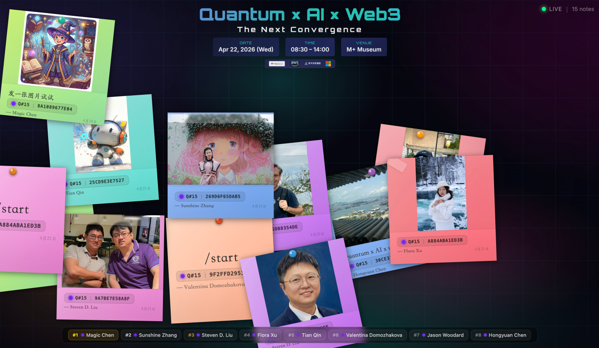
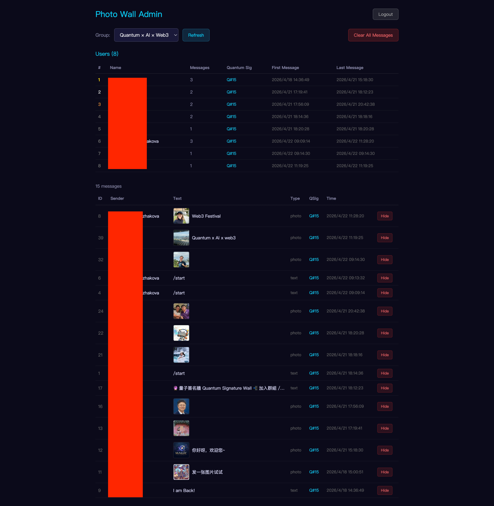

# Telegram Photo Wall — UI Page Descriptions

This document provides a **technical, implementation-oriented walkthrough** of each user interface surface in the **Quantum Web3 Interactive Registration / Telegram Photo Wall** experience. It is written for engineers, designers, researchers, and reviewers who require a structured understanding of **screen purpose, user flow, captured data, system behavior, and technical context**.

The UI documentation reflects the implemented interaction flow used in live event demonstrations and aligns with the system architecture described in [`architecture.md`](../architecture.md).

> ✅ **Scientific Note**
> The quantum signature attached to every wall card is generated by **Amazon Braket SV1**, a managed state-vector quantum simulator. The cryptographic envelope (ToyLWE-style key derivation and signature) is a demonstrative post-quantum artifact, not an operational PQC deployment. Public references to AWS Braket capabilities align with the official AWS documentation:
> https://docs.aws.amazon.com/braket/

---

## 🔬 Scientific Background

Telegram Photo Wall is designed as an **event-grade interactive experience** demonstrating how a quantum-cloud signing pipeline can be embedded into an everyday social input channel (a Telegram group) and surfaced as a real-time visualization.

The deployment combines three trends:

- **Cloud-accessible quantum computing** — small-scale circuits (4-qubit randomness, 2-qubit Bell-state) executed on Amazon Braket SV1 within an event's latency budget,
- **Post-quantum identity primitives** — a per-user lattice-flavored ToyLWE keypair derived from quantum entropy, surfaced as a stable `Q#number | publicKeyHash` badge,
- **Audience participation in distributed systems** — Telegram messages with an `@bot` mention act as the only entry point, providing a low-friction governance-style consent gate.

The experience does not claim quantum advantage or operational cryptographic security. Instead, it illustrates:

- how a managed QPU/simulator can sit behind a normal user interaction without disrupting UX,
- how quantum-derived entropy can seed a verifiable per-user artifact that persists across messages,
- how an event organizer can curate, moderate, and project quantum-authenticated audience content at scale.

---

## 📚 Contents

- [UX Flow Summary](#ux-flow-summary)
- [Screens](#screens)
  - [1. 💬 Telegram Submission Surface](#1--telegram-submission-surface-page-1png)
  - [2. 🪧 Public Photo Wall](#2--public-photo-wall-page-2png)
  - [3. 🛠️ Admin Dashboard](#3--admin-dashboard-page-3png)
- [🌐 Interdisciplinary Contributions & SDG Alignment](#-interdisciplinary-contributions--sdg-alignment)
- [📖 Glossary](#-glossary)
- [⚖️ Limitations & Non-Claims](#️-limitations--non-claims)

---

## UX Flow Summary

The interface follows a **3-surface guided flow** that mirrors how content moves from an audience member through a cloud-quantum pipeline to a public projection.

  

    <b>🧭 Experience Flow</b>
    <ul>
      <li>💬 Page 1 — Telegram submission (audience-side input)</li>
      <li>🪧 Page 2 — Public photo wall (real-time projection)</li>
      <li>🛠️ Page 3 — Admin dashboard (curation & moderation)</li>
    </ul>
  

  

    <b>🗂️ Data Captured</b>
    <ul>
      <li>Sender identity (display name, @username)</li>
      <li>Mention-gated message text and/or photo</li>
      <li>Per-user quantum random number (0–1000)</li>
      <li>Bell-state probability vector [P(00), P(01), P(10), P(11)]</li>
      <li>ToyLWE public key hash and signature</li>
      <li>Card position (drag-persisted, percentage-based)</li>
    </ul>
  

The flow follows three experience design principles:

| Principle | Surface | Purpose |
|---|---|---|
| **Input → Trust** | Page 1 | Capture audience contributions through a familiar channel and gate them with `@bot` consent |
| **Quantum → Visibility** | Page 2 | Project quantum-signed contributions as a live, interactive wall |
| **Governance → Quality** | Page 3 | Give event organizers moderation and provenance tools without breaking the wall |

---

## Screens

---

### 1. 💬 Telegram Submission Surface (`page-1.png`)

<figure style="margin:16px 0; padding:12px; border:1px solid #e5e7eb; border-radius:14px;">
  
  <figcaption><b>Figure 1.</b> Audience-side submission inside a Telegram group, with the bot mention acting as the consent and routing gate.</figcaption>
</figure>

**Purpose**

Provide a zero-install, low-friction submission channel by reusing the audience's existing Telegram client. Only messages that explicitly `@mention` the configured bot are routed to the wall, which doubles as an opt-in signal.

**Technical Context**

- Telegram Bot API webhook delivers updates to `POST /api/webhook/[groupId]` over HTTPS, validated by the `X-Telegram-Bot-Api-Secret-Token` header
- Bot **Privacy Mode** is disabled in BotFather so the bot can observe group messages, but only `@mention`-bearing messages are persisted
- Photos are downloaded via Telegram's `getFile` API (≤20 MB) and uploaded to a private, encrypted S3 bucket; the database row is created with `signatureStatus = "generating"` before the quantum task is queued
- Text is HTML-entity-encoded server-side (≤4096 chars) to prevent XSS when rendered on the wall
- Group identity is bound by `chat_id`; multi-group deployments share infrastructure but isolate data per `groupId`

**User Actions**

- Add the event bot to the Telegram group
- Send a text or photo message containing `@event_bot_username`
- Optionally include a caption or extended text — both are displayed on the wall card

**Outcome**

A pending wall entry is created. The next time the user sends a message in the same group, the existing quantum signature is reused; for a brand-new sender, a Braket task is launched (see Page 2 for what surfaces).

---

### 2. 🪧 Public Photo Wall (`page-2.png`)

<figure style="margin:16px 0; padding:12px; border:1px solid #e5e7eb; border-radius:14px;">
  
  <figcaption><b>Figure 2.</b> Public-facing photo wall: sticky-note cards with quantum-signature badges, leaderboard, and event-branded background.</figcaption>
</figure>

**Purpose**

Project all approved contributions as a live, sci-fi-styled sticky-note wall designed for large-screen display at events, with a per-user quantum identity badge that is both decorative and verifiable.

**Technical Elements**

- **Sticky-note cards** rendered via `MessageCard`; each card carries:
  - sender display name and `@username`,
  - text and/or photo (with click-to-zoom lightbox),
  - **quantum badge** in the form `Q#{quantumNumber} | {publicKeyHash}` (e.g., `Q#452 | 7B284BB3D413`),
  - HSL accent color derived from `quantumNumber` and Bell-state probabilities so each user has a stable visual identity
- **Real-time updates** via 5-second polling against `GET /api/messages/[groupId]?after={lastTimestamp}`; new cards animate in
- **Drag-and-drop layout**: cards are absolute-positioned with percentage coordinates persisted via `PATCH /api/messages/[groupId]`, so layouts survive resize and refresh
- **Leaderboard** at the bottom ranks top contributors by message count for the active group
- **Event branding** is applied via `/public/logo.png` overlay and configurable background

**Quantum Signature Pipeline (per new sender)**

- **Task A — 4-qubit RNG circuit** on Braket SV1 (100 shots): H gates → CNOT chain → seeded `Ry` rotations → measure; top bitstring becomes `quantumNumber = int(top_bits, 2) mod 1001`
- **Task B — 2-qubit Bell state** `|Φ⁺⟩` on Braket SV1 (200 shots): H on q[0] → CNOT(q[0],q[1]) → measure; result yields `bellState = [P(00), P(01), P(10), P(11)]`
- **ToyLWE wrapper**: SHAKE-256(seed ‖ quantumNumber ‖ random) derives a keypair; SHA-256 chain produces the 24-character base64 signature; first 12 hex chars of the public-key digest become the badge identifier
- Subsequent messages from the same `(groupId, senderId)` reuse the cached signature — no additional Braket call is made

**User Actions**

- Watch new contributions appear without refreshing
- Click any photo to open the fullscreen lightbox
- Drag a card on touch- or mouse-driven displays to recompose the wall (positions persist across viewers)

**Outcome**

An audience-visible, quantum-authenticated record of the event's social participation, with stable per-user identity badges that make repeat contributors recognizable across messages.

---

### 3. 🛠️ Admin Dashboard (`page-3.png`)

<figure style="margin:16px 0; padding:12px; border:1px solid #e5e7eb; border-radius:14px;">
  
  <figcaption><b>Figure 3.</b> Password-gated admin dashboard for moderation, group selection, and quantum-signature provenance review.</figcaption>
</figure>

**Purpose**

Give event organizers a controlled surface to moderate live audience content, audit quantum-signature provenance, and clear or reset a wall between sessions, without ever exposing the underlying message store.

**Technical Context**

- **Authentication**: `POST /api/admin` validates the password against AWS Secrets Manager (`telegram/admin-password`); the password doubles as a Bearer token used by all subsequent admin requests
- **Group selector** lists every configured group from `GET /api/groups`; each group has an isolated message and signature view
- **Message table** surfaces sender, text, type (text/photo), timestamp, and `signatureStatus` (`generating` / `completed` / `fallback`)
- **Soft delete**: `DELETE /api/messages/[groupId]?sk=...` flips a `hidden` flag in DynamoDB rather than removing the row, so audit history and quantum signatures remain intact
- **Bulk clear**: `DELETE /api/admin?action=clear&groupId=X` soft-deletes all messages in a group — useful between event sessions
- **Provenance view**: each row exposes `quantumNumber`, `publicKeyHash`, `bellState`, `algorithm` (`ToyLWE-Braket-SV1` or `ToyLWE-local-fallback`), and `device` (`SV1` or `local-fallback`)
- All admin endpoints are reachable only via the CloudFront → ALB path with the secret-header check, so the dashboard is never exposed to direct ALB traffic

**Admin Actions**

- Log in with the secrets-managed password
- Switch between configured groups
- Hide individual messages (e.g., off-topic, low-quality, or accidental sends)
- Clear all messages for a group at the start or end of a session
- Inspect quantum-signature metadata to confirm a row was signed by Braket SV1 vs. the local fallback

**Outcome**

The wall stays curated and on-brand throughout an event, while every moderation action is reversible at the data layer and every visible card has verifiable quantum-execution provenance.

---

## 🌐 Interdisciplinary Contributions & SDG Alignment

The interaction flow connects technical concepts in cloud quantum computing, post-quantum identity, and event-grade Web3 infrastructure with interdisciplinary stakeholder perspectives. Each surface represents both a user interaction step and a contribution point toward broader ecosystem understanding, reflecting how quantum-authenticated participation involves research, engineering, governance, and public engagement.

The table below maps experience surfaces to technical focus, contribution type, stakeholder communities, and relevant United Nations Sustainable Development Goals (SDGs).

---

### Demonstration Flow, Technical Contributions, and Community Impact

| Surface | Focus (F) · Contribution (C) · Insight (I) | Communities Engaged | UN SDGs |
|---|---|---|---|
| 💬 **P1 — Telegram Submission** | **F:** Capture audience contributions through a zero-install, mention-gated channel. **C:** Apply consent-by-mention as a lightweight opt-in suitable for live events. **I:** Show that high-friction PQC plumbing can sit behind a familiar messaging UX. | 📣 Public · 🎨 Designers · 📚 Educators · ⚖️ Governance | SDG 4 · SDG 9 · SDG 16 · SDG 17 |
| 🪧 **P2 — Public Photo Wall** | **F:** Project quantum-signed audience contributions in real time. **C:** Bind every card to a Braket-derived `quantumNumber` and ToyLWE public-key hash, making quantum identity visible and stable. **I:** Demonstrate that managed cloud QPUs/simulators can be embedded into live UX without breaking latency budgets. | 👩‍🔬 Researchers · 👨‍💻 Engineers · 💼 Investors · 📚 Educators · 📣 Public | SDG 4 · SDG 9 · SDG 12 · SDG 13 · SDG 16 |
| 🛠️ **P3 — Admin Dashboard** | **F:** Provide moderation and provenance review for organizers. **C:** Surface execution metadata (`device`, `algorithm`, `signatureStatus`) per row, supporting transparent governance. **I:** Reinforce that operational trust in audience-facing quantum systems requires both moderation and verifiable provenance. | 👨‍💻 Engineers · ⚖️ Governance · 🏛️ Policy · 💼 Investors · 👩‍🔬 Researchers | SDG 4 · SDG 9 · SDG 16 · SDG 17 |

---

### Community Legend

- 👩‍🔬 **Researchers** — scientific discovery and algorithm development
- 👨‍💻 **Engineers** — system implementation and infrastructure design
- 🎨 **Designers** — interaction and user experience development
- 📚 **Educators** — knowledge transfer and technical literacy
- 💼 **Investors** — strategic and ecosystem decision perspectives
- ⚖️ **Governance** — regulation and institutional oversight
- 🏛️ **Policy** — policy-making and institutional authority
- 📣 **Public** — non-specialist participants and users
- 🌱 **Sustainability** — environmental and lifecycle considerations

---

Across the three surfaces, the experience demonstrates that a quantum-authenticated participation system is not purely a cryptographic upgrade but a socio-technical pipeline involving cloud-quantum execution, identity persistence, latency tradeoffs, governance considerations, and public-facing visualization.

---

## 📖 Glossary

| Term | Definition |
|---|---|
| Amazon Braket | AWS managed service for running circuits on quantum simulators and QPUs. |
| SV1 | Braket's full state-vector simulator, used here for both circuits. |
| Bell State | A maximally entangled two-qubit state; the Bell-state distribution acts as a structural witness in the badge. |
| Quantum Random Number | Integer derived from the most-frequent measurement bitstring of the 4-qubit RNG circuit. |
| ToyLWE | A demonstrative lattice-style key derivation and signature wrapper used to produce the per-user badge. |
| Public Key Hash | First 12 hex characters of the SHA-256 digest of the ToyLWE public key. |
| Signature Status | DynamoDB flag tracking whether a row is `generating`, `completed`, or in `fallback`. |
| Local Fallback | Crypto-only signing path used when Braket times out or fails, preserving UX continuity. |
| Mention Gate | The requirement that a Telegram message must `@mention` the bot to be persisted. |
| Soft Delete | Setting `hidden = true` on a row instead of removing it, preserving audit and provenance. |

---

## ⚖️ Limitations & Non-Claims

Telegram Photo Wall is an **event-grade demonstration system**:

- It does not perform quantum cryptanalysis or operational PQC key exchange.
- ToyLWE artifacts are demonstrative; they are not standardized PQC primitives.
- Braket SV1 is a state-vector **simulator**; results reflect simulated circuit outcomes, not native QPU execution.
- A local crypto fallback is used when Braket is unavailable; affected rows are marked `local-fallback` and remain visually identical to preserve UX.
- All audience data is scoped to the event group, soft-deletable, and protected by Secrets-Manager-backed access control.

The goal is to make cloud-quantum execution and post-quantum identity legible to a live audience, not to provide standalone security guarantees.
