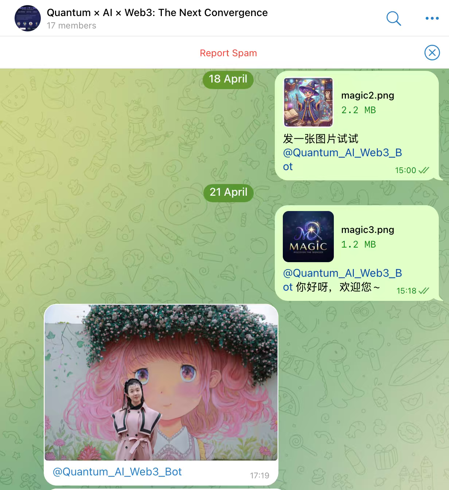

# Telegram 照片墙 — UI 页面说明

本文档为 **Quantum Web3 Interactive Registration / Telegram 照片墙** 的每一个用户界面提供**面向工程实现的技术化走查**。读者对象包括工程师、设计师、研究人员与评审者，他们希望对每个屏幕的**目的、用户流程、采集数据、系统行为与技术上下文**有结构化的理解。

本 UI 文档与 [`architecture.md`](../architecture.md) 中描述的系统架构保持一致。

> ✅ **科学声明**
> 每张墙上卡片附带的量子签名由 **Amazon Braket SV1**（一个托管的态向量量子模拟器）生成。其外部包装的密码学外壳（ToyLWE 风格的密钥派生与签名）属于演示性质的后量子构件，不属于可用于生产的 PQC 部署。AWS Braket 的能力对齐其官方文档：
> https://docs.aws.amazon.com/braket/

---

## 🔬 科学背景

Telegram 照片墙是一个**活动级别的交互式体验**，演示如何把一条云端量子签名管线嵌入到日常社交输入通道（Telegram 群组），并把结果以实时可视化方式呈现出来。

整体部署融合了三股趋势：

- **云上量子计算** — 在活动的延迟预算内于 Amazon Braket SV1 上运行小规模电路（4 量子比特随机数、2 量子比特 Bell 态），
- **后量子身份原语** — 由量子熵派生的、每用户一次的格密码风格 ToyLWE 公钥/签名对，并以稳定的 `Q#number | publicKeyHash` 徽章形式呈现，
- **公众参与的分布式系统** — 使用 `@bot` mention 作为唯一入口，等价于一个低门槛的、治理风格的同意环节。

本体验**不主张**实现量子优势或可用的密码学安全。它的目标是说明：

- 托管型 QPU / 模拟器可以隐于普通用户交互之后而不影响 UX；
- 量子派生的熵可以驱动一个跨消息稳定的、每用户唯一的可验证标识；
- 活动主办方可以以可治理、可投屏的方式，向现场观众展示量子认证的用户内容。

---

## 📚 目录

- [UX 流程总览](#ux-流程总览)
- [屏幕说明](#屏幕说明)
  - [1. 💬 Telegram 提交端](#1--telegram-提交端-page-1png)
  - [2. 🪧 公共照片墙](#2--公共照片墙-page-2png)
  - [3. 🛠️ 管理员后台](#3--管理员后台-page-3png)
- [🌐 跨学科贡献与 SDG 对齐](#-跨学科贡献与-sdg-对齐)
- [📖 术语表](#-术语表)
- [⚖️ 局限与非主张](#️-局限与非主张)

---

## UX 流程总览

整个体验由 **3 个交互面** 串成，反映了内容如何从观众端流经云端量子管线，最终呈现到公共投屏上。

  

    <b>🧭 体验流程</b>
    <ul>
      <li>💬 第 1 页 — Telegram 提交端（观众侧输入）</li>
      <li>🪧 第 2 页 — 公共照片墙（实时投屏）</li>
      <li>🛠️ 第 3 页 — 管理员后台（策展与审核）</li>
    </ul>
  

  

    <b>🗂️ 采集数据</b>
    <ul>
      <li>发送者身份（显示名、@username）</li>
      <li>带 mention 的消息文本和/或图片</li>
      <li>每用户一个的量子随机数（0–1000）</li>
      <li>Bell 态概率向量 [P(00), P(01), P(10), P(11)]</li>
      <li>ToyLWE 公钥哈希与签名</li>
      <li>卡片位置（拖拽持久化，按百分比存储）</li>
    </ul>
  

整个流程贯彻三条体验设计原则：

| 原则 | 交互面 | 目的 |
|------|--------|------|
| **输入 → 信任** | 第 1 页 | 通过观众已熟悉的渠道收集贡献，并以 `@bot` mention 充当同意闸门 |
| **量子 → 可见性** | 第 2 页 | 把量子签名后的贡献作为实时墙面展示给所有观众 |
| **治理 → 质量** | 第 3 页 | 给主办方提供审核与溯源工具，同时不打断墙面体验 |

---

## 屏幕说明

---

### 1. 💬 Telegram 提交端（`page-1.png`）

<figure style="margin:16px 0; padding:12px; border:1px solid #e5e7eb; border-radius:14px;">
  
  <figcaption><b>图 1.</b> 观众在 Telegram 群组中提交内容；bot mention 既是路由信号，也是同意闸门。</figcaption>
</figure>

**目的**

复用观众现成的 Telegram 客户端，实现零安装、低门槛的提交通道。只有显式 `@mention` 配置好的 bot 的消息才会进入墙面，相当于一个隐式的 opt-in 信号。

**技术上下文**

- Telegram Bot API webhook 通过 HTTPS 推送到 `POST /api/webhook/[groupId]`，请求由 `X-Telegram-Bot-Api-Secret-Token` 头校验
- 在 BotFather 中关闭 **Privacy Mode**，使 bot 能观察到群组消息，但只有携带 `@mention` 的消息会被持久化
- 图片走 Telegram 的 `getFile` API 下载（≤20 MB），随后上传到一个私有、加密的 S3 桶；数据库行先以 `signatureStatus = "generating"` 创建，然后再排队量子任务
- 文本在服务端按 HTML 实体编码（≤4096 字符），避免在墙面上渲染时引入 XSS
- 群组身份由 `chat_id` 绑定；多群组部署共享基础设施但按 `groupId` 隔离数据

**用户操作**

- 把活动 bot 加入到目标 Telegram 群组
- 在群组中发送带 `@event_bot_username` 的文字或图片
- 可选地附带 caption 或扩展文本——两者都会出现在墙面卡片中

**结果**

生成一条待签名的墙面记录。同一发送者后续在同一群组中再次发消息时，会复用既有签名；若是新发送者，则会启动一次 Braket 任务（详见第 2 页）。

---

### 2. 🪧 公共照片墙（`page-2.png`）

<figure style="margin:16px 0; padding:12px; border:1px solid #e5e7eb; border-radius:14px;">
  
  <figcaption><b>图 2.</b> 公共照片墙：带量子签名徽章的便利贴卡片、排行榜与活动主题背景。</figcaption>
</figure>

**目的**

把所有通过审核的贡献以实时、科幻风的便利贴墙面呈现，为大屏幕投屏而设计；每用户的量子身份徽章既是装饰也是可验证标识。

**技术要点**

- **便利贴卡片** 由 `MessageCard` 渲染，每张卡片包含：
  - 发送者显示名与 `@username`，
  - 文本和/或图片（点击图片进入 Lightbox 放大），
  - **量子徽章**：`Q#{quantumNumber} | {publicKeyHash}`（如 `Q#452 | 7B284BB3D413`），
  - 由 `quantumNumber` 与 Bell 态概率派生的 HSL 主色，使每个用户具有稳定的视觉身份
- **实时更新** 通过每 5 秒一次的 `GET /api/messages/[groupId]?after={lastTimestamp}` 轮询；新卡片淡入出现
- **拖拽布局**：卡片以百分比绝对定位，位置通过 `PATCH /api/messages/[groupId]` 持久化，刷新与窗口尺寸变化都不会丢失
- **排行榜** 在墙底按发消息数对当前群组的活跃贡献者进行排序
- **活动品牌** 通过 `/public/logo.png` 顶部 Logo 与可配置的背景图实现

**量子签名管线（针对每个新发送者）**

- **任务 A — 4 量子比特 RNG 电路** 在 Braket SV1 上（100 shots）：H 门 → CNOT 链 → 由用户名种子驱动的 `Ry` 旋转 → 测量；最高频比特串变成 `quantumNumber = int(top_bits, 2) mod 1001`
- **任务 B — 2 量子比特 Bell 态** `|Φ⁺⟩` 在 Braket SV1 上（200 shots）：q[0] 上的 H → CNOT(q[0],q[1]) → 测量；得到 `bellState = [P(00), P(01), P(10), P(11)]`
- **ToyLWE 包装**：SHAKE-256(seed ‖ quantumNumber ‖ random) 派生密钥对；SHA-256 链生成 24 字符 base64 签名；公钥哈希前 12 个十六进制字符成为徽章标识
- 同一 `(groupId, senderId)` 后续消息复用缓存的签名，**不再调用 Braket**

**用户操作**

- 不刷新即可看到新的贡献逐条加入
- 点击图片进入全屏 Lightbox
- 在触摸或鼠标设备上拖动卡片，重新组织墙面布局（位置对所有观众生效）

**结果**

形成一份观众可见、量子认证的活动社交参与档案；每用户的稳定徽章让多次发言的贡献者可以被一眼识别。

---

### 3. 🛠️ 管理员后台（`page-3.png`）

<figure style="margin:16px 0; padding:12px; border:1px solid #e5e7eb; border-radius:14px;">
  
  <figcaption><b>图 3.</b> 通过密码鉴权的管理员后台：审核、群组切换、量子签名溯源。</figcaption>
</figure>

**目的**

为活动主办方提供一个可控界面，用于审核现场观众内容、审计量子签名的来源、以及在不同会场之间清空或重置墙面，同时**绝不暴露**底层消息存储。

**技术上下文**

- **鉴权**：`POST /api/admin` 校验密码（来自 AWS Secrets Manager 的 `telegram/admin-password`）；密码本身复用为 Bearer token，所有后续管理员请求带上即可
- **群组选择器** 通过 `GET /api/groups` 列出所有配置的群组；每个群组有独立的消息与签名视图
- **消息表** 展示发送者、文本、类型（text/photo）、时间戳与 `signatureStatus`（`generating` / `completed` / `fallback`）
- **软删除**：`DELETE /api/messages/[groupId]?sk=...` 仅在 DynamoDB 上翻转 `hidden` 标志，行本身不删，因此审计与量子签名得以保留
- **批量清理**：`DELETE /api/admin?action=clear&groupId=X` 一键软删除某群组所有消息——适合在不同会场之间使用
- **溯源视图**：每行可查看 `quantumNumber`、`publicKeyHash`、`bellState`、`algorithm`（`ToyLWE-Braket-SV1` 或 `ToyLWE-local-fallback`）、`device`（`SV1` 或 `local-fallback`）
- 所有管理员端点都必须经由 CloudFront → ALB 通道（带 secret header 校验），不存在直连 ALB 的访问路径

**管理员操作**

- 用 Secrets Manager 中的密码登录
- 在不同群组之间切换
- 隐藏单条消息（如离题、低质量、误发）
- 在会场开始或结束时清空整个群组的墙面
- 检查量子签名元数据，确认某行是否由 Braket SV1 产生（而非本地回退）

**结果**

整个活动期间墙面始终保持策展与品牌一致，每一次审核操作在数据层都是可逆的，每一张可见卡片都具备可验证的量子执行溯源。

---

## 🌐 跨学科贡献与 SDG 对齐

整个交互流程把云量子计算、后量子身份与活动级 Web3 基础设施这三类技术议题，与跨学科的利益相关者视角连接起来。每一个交互面既是用户操作的一步，也是面向更广泛生态的贡献点，体现出量子认证的公众参与系统涉及研究、工程、治理与公共参与等多重维度。

下表把每个交互面映射到技术焦点、贡献类型、参与社群以及对应的联合国可持续发展目标（SDG）。

---

### 演示流程、技术贡献与社群影响

| 交互面 | 焦点（F）· 贡献（C）· 洞察（I） | 参与社群 | UN SDGs |
|---|---|---|---|
| 💬 **P1 — Telegram 提交端** | **F：** 通过零安装、mention 闸门的渠道收集观众贡献。 **C：** 把 mention 作为现场活动可用的轻量 opt-in 形式。 **I：** 证明高摩擦的 PQC 管线可以隐藏在观众熟悉的 UX 之后。 | 📣 公众 · 🎨 设计师 · 📚 教育者 · ⚖️ 治理 | SDG 4 · SDG 9 · SDG 16 · SDG 17 |
| 🪧 **P2 — 公共照片墙** | **F：** 实时投影量子签名后的观众贡献。 **C：** 把每张卡绑定到 Braket 派生的 `quantumNumber` 与 ToyLWE 公钥哈希，使量子身份可见且稳定。 **I：** 证明托管云端 QPU / 模拟器可以嵌入到现场 UX 而不超出延迟预算。 | 👩‍🔬 研究者 · 👨‍💻 工程师 · 💼 投资者 · 📚 教育者 · 📣 公众 | SDG 4 · SDG 9 · SDG 12 · SDG 13 · SDG 16 |
| 🛠️ **P3 — 管理员后台** | **F：** 给主办方提供审核与溯源界面。 **C：** 暴露每行的执行元数据（`device`、`algorithm`、`signatureStatus`），支持透明治理。 **I：** 强调面向公众的量子系统中，运行时信任既需要审核也需要可验证的来源。 | 👨‍💻 工程师 · ⚖️ 治理 · 🏛️ 政策 · 💼 投资者 · 👩‍🔬 研究者 | SDG 4 · SDG 9 · SDG 16 · SDG 17 |

---

### 社群图例

- 👩‍🔬 **研究者** — 科学发现与算法开发
- 👨‍💻 **工程师** — 系统实现与基础设施设计
- 🎨 **设计师** — 交互与用户体验设计
- 📚 **教育者** — 知识转移与技术普及
- 💼 **投资者** — 战略与生态决策视角
- ⚖️ **治理** — 监管与制度监督
- 🏛️ **政策** — 政策制定与制度权威
- 📣 **公众** — 非专业参与者与最终用户
- 🌱 **可持续** — 环境与生命周期视角

---

跨越三个交互面，本体验说明：一个量子认证的参与系统不只是密码学层面的升级，而是一条社会-技术管线，涉及云端量子执行、身份持续性、延迟权衡、治理考量与面向公众的可视化。

---

## 📖 术语表

| 术语 | 定义 |
|------|------|
| Amazon Braket | AWS 提供的托管量子模拟器与 QPU 服务。 |
| SV1 | Braket 的全态向量模拟器，本应用所有电路均在其上运行。 |
| Bell 态 | 一种最大纠缠两量子比特态；其测量分布在徽章中提供结构性见证。 |
| 量子随机数 | 4 量子比特 RNG 电路最高频比特串派生出的整数。 |
| ToyLWE | 演示用的格密码风格密钥派生与签名包装，用于生成每用户的徽章。 |
| 公钥哈希 | ToyLWE 公钥的 SHA-256 摘要前 12 个十六进制字符。 |
| 签名状态 | DynamoDB 中标记某行处于 `generating`、`completed` 或 `fallback` 之一。 |
| 本地回退 | 在 Braket 超时或失败时启用的纯密码学路径，保持 UX 连续性。 |
| Mention 闸门 | 要求 Telegram 消息必须 `@mention` bot 才会被持久化。 |
| 软删除 | 在某行上设置 `hidden = true` 而非物理删除，保留审计与溯源。 |

---

## ⚖️ 局限与非主张

Telegram 照片墙是一个**活动级演示系统**：

- 它不执行量子密码分析，也不实现可用的 PQC 密钥交换；
- ToyLWE 构件仅作演示，并非标准化 PQC 原语；
- Braket SV1 是一个**模拟器**；其结果反映的是模拟电路结果，而非原生 QPU 执行；
- 当 Braket 不可用时使用本地密码学回退，受影响行被标记为 `local-fallback`，但视觉上保持一致以维持 UX；
- 所有观众数据按活动群组隔离、可软删除，并通过 Secrets Manager 支持的访问控制保护。

本系统的目标是让云端量子执行与后量子身份**对现场观众可读**，而不是提供独立的安全保证。
